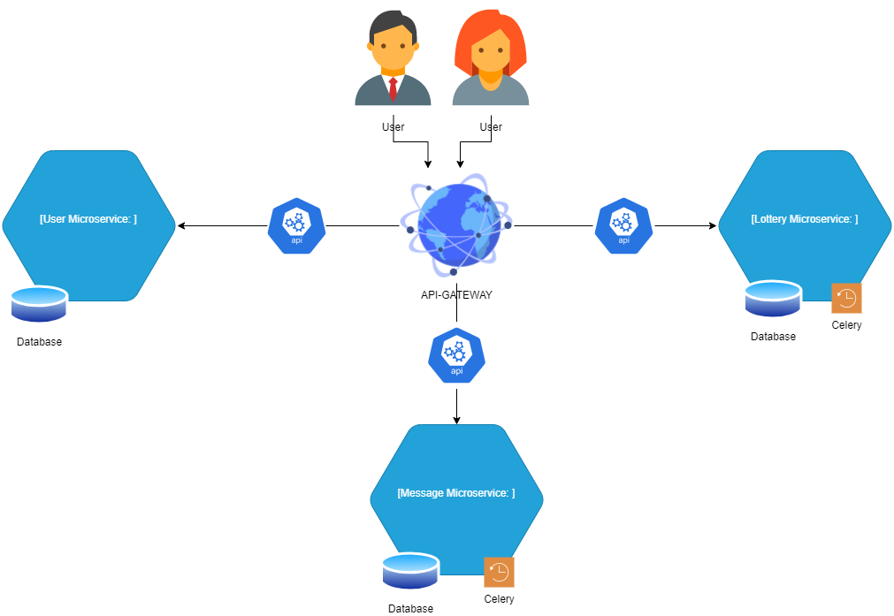

# My Message in the Bottle

This is the source code of MyMessageInTheBottle application, a
project of *Advanced Software Engineering* course,
University of Pisa.
 
## Team info

- Squad 2
- The *team leader* is *Filippo Dolente*

#### Members

|Name and Surname  | Email                         |
|------------------|-------------------------------|
|Leonardo Talerico |l.talerico@studenti.unipi.it   |
|Usman Shahzad     |u.shahzad1@studenti.unipi.it   |
|Filippo Dolente   |f.dolente@studenti.unipi.it    |

## Instructions
    These are the instructions to run the project.
    IMPORTANT: for test reason the LOTTERY POINT NECESSARY TO DELETE A MESSAGE is 0.
               You can change this parameter in the first line of API-gateway (mib/views/users.py)

### Run the project

    - run commands:
        docker-compose build
        docker-compose up

    The app is reachable at http://localhost:80

### Project Tree:

    MiB-Main/
    ├─ api-gateway/
    ├─ Lottery Microservice/
    ├─ User Microservice/
    ├─ Message Microservice/
    ├─ docker-compose.yml
    ├─ gateway.conf
    ├─ lottery_ms.conf
    ├─ user_ms.conf
    ├─ message_ms.conf

### ARCHITECTURE APPLICATION:

### USEFUL DEVELOPERS COMMAND:

    TO ADD SUBMODULES:
        - clone MiB-Main
        - open terminal and move into MiB-Main directory
        - run the command: git submodule add https://github.com/GITHUB_USERNAME/MICROSERVICE_USERNAME
        - git commit -m "comment"

    TO UPDATE SUBMODULES:
        - git submodule update --remote --merge
        - git commit -m "comment"
